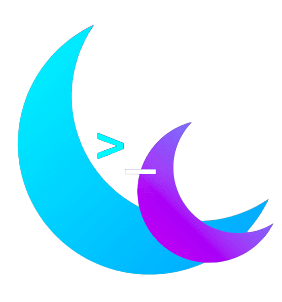

<p align="center">
  
  <b style="font-size: 56px; vertical-align: middle; color: #ffffff;">Moons Framework</b>
</p>

<div align="center">
  <p style="font-size: 20px; margin-top: 15px;"><b>Simple as a script. Fast as a binary.</b></p>
</div>

---

O **Moons Framework** é um ecossistema Lua voltado para execução e desenvolvimento rápido em ambiente isolado. Focado agressivamente na conveniência do desenvolvedor (*Developer Experience - DX*), ele abstrai completamente configurações complexas e simplifica ainda mais a sintaxe da linguagem, permitindo que você foque apenas em escrever código.

Ele automatiza o setup do seu ambiente de trabalho via Docker, permitindo rodar suas aplicações em um container configurado e pronto para uso com um único comando.

---

## 🌍 Missão e Filosofia

O Moons foi desenhado com dois propósitos fundamentais:

> 💡 **Operar na Escassez**
>
> Projetado para funcionar com alta performance em cenários de escassez severa de hardware. O consumo de recursos é levado a sério.

> 🇧🇷 **Tecnologia Nacional**
>
> Valorizar e fomentar o desenvolvimento de um ecossistema sólido e moderno utilizando tecnologias *core* nascidas no Brasil.

---

## 🏗️ Por que Lua 5.4+ e Pallene? (A Arquitetura)

O ecossistema do Moons é construído sobre a união de **Lua** (scripts simples e dinâmicos) e **Pallene** (tipagem estática e compilação *Ahead-of-Time*).

### **Por que não usar o LuaJIT?**

Embora o LuaJIT seja incrivelmente rápido, sua base arquitetural ficou presa no tempo (baseada no padrão de 2006). Para o Moons, optamos pelo **Lua 5.4+**, que traz melhorias massivas na linguagem e um *Garbage Collector (GC)* altamente refinado. Em cenários de alto desempenho, um GC moderno e eficiente previne gargalos de memória melhor do que um JIT desatualizado.

> ⚡ **O Resultado**
>
> Como o Moons executa **binários nativos compilados via Pallene** para as partes pesadas da aplicação, a sobrecarga de interpretação é mitigada logo de cara. Você tem a fluidez de um script e a velocidade brutal de um binário em C.

---

## 🐳 Docker Desde o Minuto Zero

O Moons não polui sua máquina. Desde o momento da criação do projeto, tudo roda embarcado no Docker. Isso garante:

* **Escalabilidade:** O que roda no seu PC de desenvolvimento é exatamente o que vai rodar no servidor de produção.
* **Isolamento de Dependências:** Nada de conflitos de versões de bibliotecas no seu sistema operacional.
* **Limpeza:** Apagou a pasta do projeto, o ambiente vai embora junto. Zero lixo na sua máquina.

---

## 🚀 Instalação (Zero-to-Hero)

Você não precisa ter *nada* configurado na sua máquina. Se você não tem o Git, o Docker ou as variáveis de ambiente ajustadas, o instalador do Moons faz o trabalho de um SysAdmin para você de forma silenciosa.

### 🐧 Linux (Debian/Ubuntu)

Abra seu terminal e execute:

```bash
curl -fsSL https://raw.githubusercontent.com/KAYOGS/Moons/main/install.sh | bash
```

### 🪟 Windows (PowerShell)

Abra o PowerShell como Administrador e execute:

```powershell
irm https://github.com/KAYOGS/Moons.git | iex
```

---

## 🛠️ Como Usar (CLI)

O Moons funciona como um **Daemon** em background. Ele foi feito para você abrir e fechar quantas abas de terminal quiser sem perder a estabilidade do seu ambiente de desenvolvimento.

### 🗂️ `moons` *(Criar um Projeto)*

Vá até a pasta onde deseja criar seu novo projeto e digite o comando vazio:

```bash
moons
```

*O CLI assumirá o controle, perguntará o nome do projeto, baixará a fundação oficial e inicializará um repositório Git limpo para você.*

### ⚡ `moons init` *(Iniciar ou Conectar)*

Dentro da pasta do seu projeto, digite:

```bash
moons init
```

* **Primeira vez:** Ele fará o build do container Docker, instalará as dependências e te jogará dentro do ambiente interativo.
* **Em outra aba do terminal:** Ele perceberá que o ambiente já está rodando em background e apenas conectará sua nova aba instantaneamente, sem recriar nada.

### 🛑 `moons stop` *(Encerrar o Ambiente)*

Terminou o dia de trabalho e quer liberar memória RAM?

```bash
moons stop
```

*O Daemon será encerrado e o container deletado com segurança. No dia seguinte, basta dar um `moons init` novamente.*

---

## 🇧🇷 Créditos e Agradecimentos Especiais

O Moons Framework só é possível graças ao trabalho revolucionário de pesquisadores brasileiros. 

Um agradecimento especial à equipe do **LabLua** e do **Departamento de Informática da PUC-Rio** pelo desenvolvimento incrível da linguagem Lua e da linguagem Pallene.

* 🔗 [Repositório Oficial do Pallene (GitHub)](https://github.com)
* 🔗 [Site Oficial do Lua](https://lua.org)
